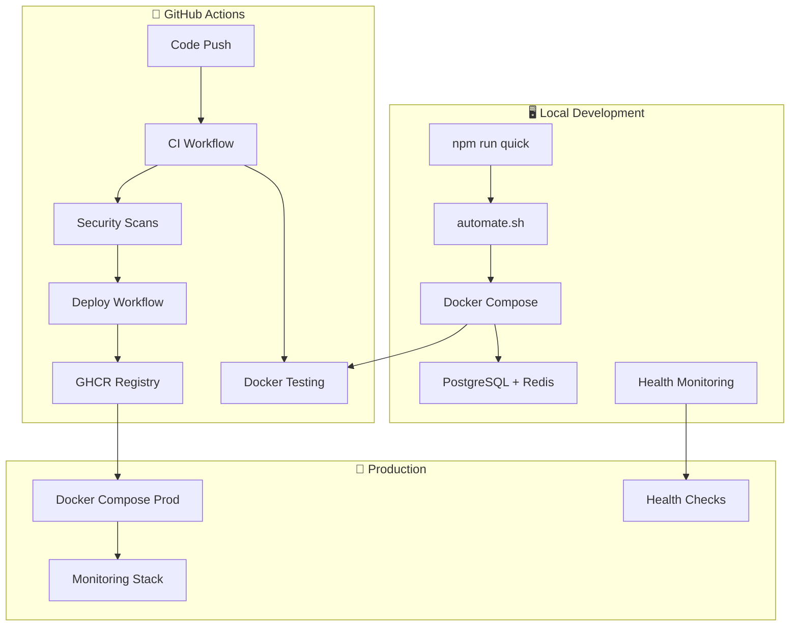

# 🚀 ShopperSprint CI/CD Pipeline

This directory contains the comprehensive CI/CD pipeline for ShopperSprint, ensuring code quality, security, and reliable deployments across multiple environments.

## 📋 Pipeline Overview

### 🔄 Workflow Structure

```text
┌─────────────────┐    ┌─────────────────┐    ┌─────────────────┐
│   Code Push     │───▶│   CI Pipeline   │───▶│  Dev Deploy    │
│   / PR         │    │                 │    │                │
└─────────────────┘    └─────────────────┘    └─────────────────┘
                                │                       │
                                ▼                       ▼
                       ┌─────────────────┐    ┌─────────────────┐
                       │ Security Scans  │    │ Prod Deploy    │
                       │                 │    │ (Manual)       │
                       └─────────────────┘    └─────────────────┘
```

## 🚀 Complete Integration Architecture

ShopperSprint features a **comprehensive automation system** that seamlessly integrates GitHub Actions, Docker, and local development. Everything is automated through intelligent scripts that work across all environments.



## 🧪 Workflows

### 1. **Continuous Integration** (`ci.yml`)

**Triggers**: Every push, PR, weekly security scans
**Purpose**: Comprehensive testing and validation

#### Jobs

- 🔒 **Security Audit**: Dependency scanning, secret detection, OWASP checks
- 📝 **Code Quality**: ESLint, TypeScript validation, Prettier checks
- 🧪 **Backend Tests**: Unit tests with PostgreSQL & Redis
- 🧪 **Frontend Tests**: Component and integration tests
- 🏗️ **Build & Package**: Application compilation and packaging
- 📊 **Test Results**: Coverage reports and PR comments

### 2. **Development Deployment** (`deploy-dev.yml`)

**Triggers**: After successful CI on `develop` or `feature/*` branches
**Purpose**: Automated deployment to development environment

#### Development Jobs

- 🔒 **Security Gate**: Verifies CI success
- 🧪 **Smoke Tests**: Quick validation before deployment
- 🚀 **Deploy**: Builds and deploys to development
- 📊 **Post-deployment**: Integration tests and verification

### 3. **Production Deployment** (`deploy-prod.yml`)

**Triggers**: After successful CI on `main` branch, manual dispatch
**Purpose**: Secure production deployment with manual approval

#### Production Jobs

- 🔒 **Production Security Gate**: Enhanced security checks
- 🧪 **Production Smoke Tests**: Production-specific validation
- 🚀 **Deploy Production**: Zero-downtime production deployment
- 📊 **Post-production**: Load testing and monitoring verification

### 4. **Security Scanning** (`security-scan.yml`)

**Triggers**: Daily at 2 AM UTC, on push/PR, manual dispatch
**Purpose**: Comprehensive security analysis

#### Security Jobs

- 🔍 **Dependency Scan**: npm audit and vulnerability assessment
- 🕵️ **Secret Scan**: TruffleHog and GitLeaks detection
- 🛡️ **OWASP Check**: Dependency vulnerability analysis
- 🔐 **Container Scan**: Trivy vulnerability scanning
- 📊 **Security Report**: Consolidated security findings

### 5. **Monitoring & Alerting** (`monitoring.yml`)

**Triggers**: Every 15 minutes, on push, manual dispatch
**Purpose**: Continuous application health monitoring

#### Monitoring Jobs

- 🔍 **Health Check**: Application and API endpoint monitoring
- 📈 **Performance**: Lighthouse CI and response time checks
- 🗄️ **Database Health**: Database and Redis connectivity
- 📊 **Metrics Collection**: System and application metrics
- 🚨 **Alert Generation**: Critical issue detection and notifications

## ⚡ One-Command Operations

```bash
# 🎯 QUICK START (Interactive setup)
npm run quick           # Complete setup with guided prompts

# 🛠️ DEVELOPMENT
npm run setup           # Full development environment setup
npm run dev             # Start development with health checks
npm run health          # Comprehensive health monitoring

# 🏗️ BUILDING & TESTING
npm run build           # Build for production
npm run test            # Run all tests with coverage

# 🚀 DEPLOYMENT
npm run deploy          # Deploy to production
npm run deploy:staging  # Deploy to staging environment
npm run deploy:railway  # Deploy to Railway.com (interactive)
npm run deploy:railway:single    # Single service deployment
npm run deploy:railway:separate  # Separate services deployment  
npm run deploy:railway:backend   # Backend only
npm run deploy:railway:frontend  # Frontend only

# 🔧 AUTOMATION CONTROL
npm run automate        # Direct access to automation script
```

## 🔒 Security Features

### Pre-deployment Security Gates

- ✅ Dependency vulnerability scanning
- ✅ Secret and credential detection
- ✅ Code quality and linting checks
- ✅ Security policy enforcement
- ✅ Container image security scanning

### Continuous Security Monitoring

- 🔍 Daily automated security scans
- 🕵️ Real-time secret detection
- 🛡️ OWASP dependency analysis
- 🔐 Container vulnerability assessment
- 📊 Security report generation

## 🚀 Deployment Environments

### Development Environment

- **URL**: `dev-shoppersprint.railway.app`
- **Auto-deploy**: Yes (after CI success)
- **Approval**: Not required
- **Testing**: Smoke tests and integration tests

### Staging Environment

- **URL**: `staging-shoppersprint.railway.app`
- **Auto-deploy**: Manual promotion from development
- **Approval**: Team approval required
- **Testing**: Comprehensive validation and load testing

### Production Environment

- **URL**: `shoppersprint.railway.app` → `shoppersprint.com`
- **Auto-deploy**: No (manual approval required)
- **Approval**: Required (environment protection)
- **Testing**: Comprehensive validation and load testing

## 📊 Quality Gates

### Code Quality Requirements

- ✅ All tests must pass
- ✅ Code coverage thresholds met
- ✅ No critical security vulnerabilities
- ✅ Linting and formatting standards met
- ✅ TypeScript compilation successful

### Security Requirements

- ✅ No secrets in code
- ✅ Dependency vulnerabilities below threshold
- ✅ Container images pass security scan
- ✅ OWASP checks pass
- ✅ Security policy compliance

### Performance Requirements

- ✅ Response time < 2 seconds
- ✅ Lighthouse score > 90
- ✅ Health checks pass
- ✅ Database connectivity verified
- ✅ Redis connectivity verified

## 🛠️ Configuration

### Environment Variables

```bash
# Required for deployments
GITHUB_TOKEN          # GitHub Actions token
DOCKER_USERNAME       # Container registry username
DOCKER_PASSWORD       # Container registry password

# Database Configuration
DATABASE_URL          # PostgreSQL connection URL
REDIS_URL            # Redis connection URL

# Application Configuration
JWT_SECRET           # JWT signing secret
NODE_ENV             # Environment (development/staging/production)

# Optional for notifications
SLACK_WEBHOOK_URL     # Slack notifications
DISCORD_WEBHOOK_URL   # Discord notifications
EMAIL_SMTP_CONFIG     # Email notifications
```

### Branch Protection Rules

```yaml
# main branch
- Require status checks to pass
- Require branches to be up to date
- Require pull request reviews
- Require security policy compliance

# develop branch
- Require status checks to pass
- Require branches to be up to date
```

## 🐳 Docker Integration

### Development Environment (`docker-compose.yml`)

- **PostgreSQL + Redis containers** for local development
- **pgAdmin** for database management
- **Automatic health checks** and service discovery
- **Network isolation** with `shoppersprint-network`

### Production Environment (`docker-compose.prod.yml`)

- **Application containers** (Frontend + Backend)
- **Monitoring stack** (Prometheus + Grafana + ELK)
- **Reverse proxy** (Nginx with SSL)
- **Resource limits** and security hardening
- **Automatic backups** and log aggregation

### Container Registry Strategy

**Image Tagging Convention:**

```bash
# Development images
ghcr.io/ntanwir10/shoppersprint-frontend:dev-abc123
ghcr.io/ntanwir10/shoppersprint-backend:dev-abc123

# Staging images  
ghcr.io/ntanwir10/shoppersprint-frontend:staging-def456
ghcr.io/ntanwir10/shoppersprint-backend:staging-def456

# Production images
ghcr.io/ntanwir10/shoppersprint-frontend:prod-ghi789
ghcr.io/ntanwir10/shoppersprint-frontend:latest
ghcr.io/ntanwir10/shoppersprint-backend:prod-ghi789  
ghcr.io/ntanwir10/shoppersprint-backend:latest
```

## 📈 Monitoring & Metrics

### Application Metrics

- **Response Time**: Target < 2 seconds
- **Uptime**: Target 99.9%
- **Error Rate**: Target < 0.1%
- **User Activity**: Active users and API requests

### System Metrics

- **CPU Usage**: Monitor resource utilization
- **Memory Usage**: Track memory consumption
- **Disk Usage**: Monitor storage capacity
- **Network**: Track bandwidth and latency

### Security Metrics

- **Vulnerability Count**: Track security issues
- **Scan Frequency**: Daily security assessments
- **Compliance Score**: Security policy adherence
- **Incident Response**: Time to resolution

## 🚨 Alerting & Notifications

### Critical Alerts

- ❌ Application health check failure
- ❌ Security vulnerability detected
- ❌ Performance degradation
- ❌ Database connectivity issues
- ❌ Deployment failures

### Notification Channels

- 📧 **Email**: Team notifications
- 💬 **Slack**: Real-time alerts
- 🔔 **Discord**: Team communication
- 📱 **SMS**: Critical incidents
- 🚨 **PagerDuty**: On-call escalation

## 🔧 Troubleshooting

### Common Issues

#### CI Pipeline Failures

```bash
# Check test failures
npm run test:coverage

# Verify linting
npm run lint

# Check security vulnerabilities
npm audit
```

#### Deployment Failures

```bash
# Verify environment variables
echo $ENVIRONMENT_VAR

# Check Docker images
docker images | grep shoppersprint

# Verify network connectivity
curl -f https://shoppersprint.railway.app/health
```

#### Security Scan Failures

```bash
# Check for secrets
trufflehog --path .

# Verify dependencies
npm audit --audit-level=high

# Check container vulnerabilities
trivy image shoppersprint-backend:latest
```

### Debug Commands

```bash
# View workflow logs
gh run view --log

# Rerun failed jobs
gh run rerun --failed

# Download artifacts
gh run download

# Check workflow status
gh run list
```

## 📚 Best Practices

### Development Workflow

1. **Create Feature Branch**: `git checkout -b feature/new-feature`
2. **Make Changes**: Implement your feature
3. **Run Tests Locally**: `npm run test`
4. **Push & Create PR**: `git push origin feature/new-feature`
5. **Wait for CI**: All checks must pass
6. **Code Review**: Get approval from team
7. **Merge**: Merge to develop branch

### Deployment Process

1. **CI Success**: All tests and security checks pass
2. **Dev Deployment**: Automatic deployment to development
3. **Testing**: Verify functionality in dev environment
4. **Production Approval**: Manual approval required
5. **Production Deployment**: Zero-downtime deployment
6. **Verification**: Post-deployment health checks

### Security Guidelines

1. **Never commit secrets**: Use environment variables
2. **Regular updates**: Keep dependencies updated
3. **Security reviews**: Regular security assessments
4. **Access control**: Limit production access
5. **Monitoring**: Continuous security monitoring

## 🚂 Railway.com Deployment

### Quick Railway Deployment

```bash
# Install Railway CLI
npm install -g @railway/cli

# Login to Railway
railway login

# Deploy frontend + backend as one service (current approach)
npm run deploy:railway:single

# Or deploy backend and frontend as separate Railway services
npm run deploy:railway:separate
```

### Railway Environment Configuration

```bash
# Configure environment variables
railway variables set DATABASE_URL=${{Postgres.DATABASE_URL}}
railway variables set REDIS_URL=${{Redis.REDIS_URL}}  
railway variables set JWT_SECRET=your-jwt-secret-key
railway variables set NODE_ENV=production

# Deploy
railway up
```

## 🤝 Contributing

### Adding New Workflows

1. Create new workflow file in `.github/workflows/`
2. Follow naming conventions
3. Add appropriate triggers and conditions
4. Include comprehensive testing
5. Document in this README

### Modifying Existing Workflows

1. Test changes in development branch
2. Ensure backward compatibility
3. Update documentation
4. Get team approval
5. Monitor deployment success

## 📞 Support

### Team Contacts

- **DevOps Lead**: [@ntanwir10](mailto:devops@shoppersprint.com)
- **Security Team**: [@security-team](mailto:security@shoppersprint.com)
- **Development Team**: [@dev-team](mailto:dev@shoppersprint.com)

### Emergency Contacts

- **On-call Engineer**: [@oncall](mailto:oncall@shoppersprint.com)
- **System Administrator**: [@sysadmin](mailto:sysadmin@shoppersprint.com)

## 🎯 Implementation Status

### ✅ Completed Components

- **Continuous Integration**: Full CI pipeline with testing, linting, and security scans
- **Multi-Environment Deployment**: Development and production deployment workflows  
- **Docker Containerization**: Frontend and backend Dockerfiles with docker-compose
- **Security Scanning**: Automated dependency scanning and vulnerability assessment
- **Health Monitoring**: Basic health checks and monitoring endpoints
- **Automation Scripts**: Complete automation system with intelligent scripts

### 📋 Next Steps

#### Database Management Automation

- Production database migrations automation
- Automated database backups and restore procedures
- Database health monitoring enhancements

#### Enhanced Testing Pipeline

- Integration testing suite implementation
- Performance testing automation
- Enhanced security scanning integration

#### Advanced Deployment Features

- Blue-green deployment strategy implementation
- Automated rollback procedures enhancement
- Comprehensive monitoring and alerting expansion

---

**Last Updated**: $(date)
**Pipeline Version**: 2.0.0
**Maintainer**: ShopperSprint DevOps Team
**Project**: ShopperSprint - Comprehensive Price Tracking System
