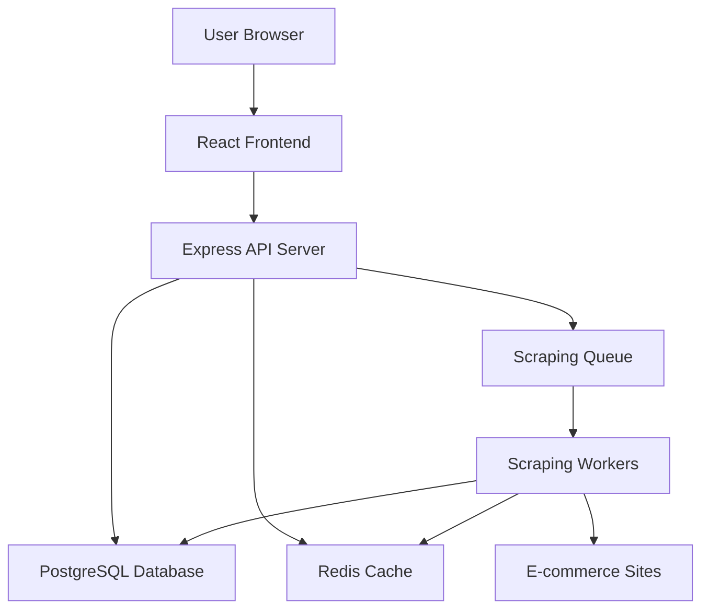
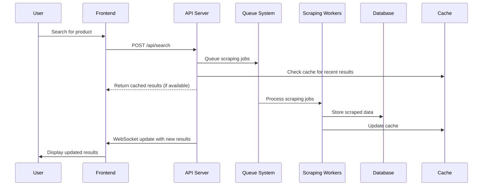

# Comprehensive Project Plan: Product Price Tracker

## 1. Overview

### 1.1. Project Summary

Product Price Tracker is a full-stack web application that enables users to search for products across multiple online sources and compare prices in real-time. The application scrapes and aggregates product information from various e-commerce sites, providing users with comprehensive price comparisons, sorting capabilities, and real-time price updates. The system categorizes sources into popular retailers and alternative sources while ensuring data validity and accuracy.

### 1.2. Goals and Objectives

* To provide a centralized platform for users to find the best prices for products online
* To deliver a fast, accurate, and user-friendly experience across all devices
* To build a scalable and maintainable application with comprehensive error handling
* To implement an advertisement system for revenue generation
* To create a robust web scraping infrastructure that respects rate limits and handles failures gracefully

### 1.3. Technology Stack

* **Frontend:**
  * **Framework:** React with TypeScript
  * **Build Tool:** Vite
  * **Styling:** Tailwind CSS with shadcn/ui component library
  * **State Management:** React hooks with local and global state
* **Backend:**
  * **Framework:** Node.js with Express.js and TypeScript
  * **Database:** PostgreSQL with Prisma ORM
  * **Caching:** Redis for search results and session data
  * **Web Scraping:** Puppeteer for dynamic content, Cheerio for static HTML parsing
  * **Queue System:** Bull Queue with Redis for managing scraping jobs
* **Deployment:**
  * **Containerization:** Docker containers
  * **Frontend:** Vercel (planned)
  * **Backend:** AWS or Heroku (planned)

### 1.4. Core Reasons We Need a Database

#### **Product Data Persistence**

* **Product Information**: Store product names, categories, specifications
* **Price History**: Track price changes over time to show trends
* **Product Matching**: Match products across different sources (Amazon, Walmart, etc.)

#### **Search Results Caching & Storage**

* **Search Queries**: Store what users searched for
* **Results History**: Keep track of previous search results
* **Performance**: Avoid re-scraping the same data repeatedly

#### **Source Management**

* **E-commerce Sources**: Store configuration for different websites we scrape
* **Rate Limiting**: Track how often we've scraped each source
* **Source Health**: Monitor which sources are working/failing

#### **User Experience Features**

* **Recent Searches**: Show users their search history
* **Favorites**: Let users save products they're tracking
* **Price Alerts**: Store user preferences for price drop notifications

#### **Business Intelligence**

* **Popular Products**: Track what users search for most
* **Source Performance**: Analyze which retailers have the best prices
* **Advertisement Data**: Store ad performance metrics

## 2. Architecture

### 2.1. High-Level Architecture



### 2.2. Component Interaction Flow



## 3. Requirements and User Stories

### 3.1. Core User Stories

#### Requirement 1: Product Search
**User Story:** As a user, I want to search for products using a simple search interface, so that I can quickly find price comparisons across multiple sources.

**Acceptance Criteria:**

* Landing page displays clean search functionality
* Search accepts text input of at least 3 characters
* System initiates search across multiple e-commerce sources
* Loading indicator displayed during search
* Validation messages for empty or short queries

#### Requirement 2: Search Results Display
**User Story:** As a user, I want to view search results in a comprehensive table format, so that I can easily compare products and prices across different sources.

**Acceptance Criteria:**

* Results displayed in structured table format
* Shows product name, price, source, availability status, and product image
* Sources categorized as "Popular Retailers" and "Alternative Sources"
* Clear indication of unavailability status
* Timestamp of last price update displayed

#### Requirement 3: Price Sorting
**User Story:** As a user, I want to sort search results by price, so that I can quickly identify the best deals available.

**Acceptance Criteria:**

* Sorting options for price (low to high, high to low)
* Results reordered within 2 seconds
* Sort order maintained until changed
* Out-of-stock items placed at end of list

#### Requirement 4: Real-time Price Refresh
**User Story:** As a user, I want to refresh price data in real-time, so that I can ensure I'm seeing the most current pricing information.

**Acceptance Criteria:**

* "Refresh Prices" button provided
* Updated prices fetched from all sources
* Loading indicators for each item being updated
* Price changes highlighted with visual indicators
* "Last updated" timestamp updated

#### Requirement 5: Product Comparison
**User Story:** As a user, I want to compare multiple products side-by-side, so that I can make informed purchasing decisions.

**Acceptance Criteria:**

* Checkboxes for product selection
* "Compare Selected" button enabled when products selected
* Side-by-side comparison view displayed
* Key differences highlighted
* Return to main results view allowed

#### Requirement 6: Data Validation and Error Handling
**User Story:** As a system administrator, I want the application to validate data sources and handle errors gracefully, so that users receive reliable and accurate information.

**Acceptance Criteria:**

* Sources validated for accessibility and response
* Search continues with other sources if one fails
* Invalid data excluded from results
* Helpful messages for no results
* Rate limiting with exponential backoff retry

#### Requirement 7: Performance and Responsiveness
**User Story:** As a user, I want the application to be responsive and fast, so that I can efficiently search and compare products on any device.

**Acceptance Criteria:**

* Landing page loads within 3 seconds
* Initial search results within 10 seconds
* Responsive design for screens 320px and wider
* Pagination or infinite scroll for large result sets
* Caching of recent search results

#### Requirement 8: Enhanced Product Information
**User Story:** As a user, I want to access detailed product information, so that I can make informed purchasing decisions beyond just price comparison.

**Acceptance Criteria:**

* Links to original product pages
* Display of reviews and ratings when available
* Key specifications shown in results
* Product pages open in new tabs
* Thumbnail images displayed in results table

#### Requirement 9: Advertisement System
**User Story:** As a business stakeholder, I want to display relevant advertisements to users, so that the application can generate revenue while providing value to users.

**Acceptance Criteria:**

* Banner advertisements on landing page
* Sponsored product listings clearly marked
* Ads relevant to user's search query
* Click-through rates and engagement tracking
* Clear visual separation between organic results and ads

## 4. Data Models

### 4.1. Product Model
```typescript
interface Product {
  id: string;
  name: string;
  normalizedName: string; // For matching across sources
  category?: string;
  specifications?: Record<string, any>;
  createdAt: Date;
  updatedAt: Date;
}
```

### 4.2. ProductListing Model
```typescript
interface ProductListing {
  id: string;
  productId: string;
  sourceId: string;
  url: string;
  price: number;
  currency: string;
  availability: 'in_stock' | 'out_of_stock' | 'limited' | 'unknown';
  imageUrl?: string;
  rating?: number;
  reviewCount?: number;
  lastScraped: Date;
  isValid: boolean;
}
```

### 4.3. Search Model
```typescript
interface Search {
  id: string;
  query: string;
  results: ProductListing[];
  metadata: {
    totalSources: number;
    successfulSources: number;
    searchDuration: number;
    cacheHit: boolean;
  };
  createdAt: Date;
}
```

### 4.4. Source Model
```typescript
interface Source {
  id: string;
  name: string;
  category: 'popular' | 'alternative';
  isActive: boolean;
  lastSuccessfulScrape: Date;
  errorCount: number;
  averageResponseTime: number;
  configuration: ScrapingSource;
}
```

### 4.5. Advertisement Model
```typescript
interface Advertisement {
  id: string;
  title: string;
  description: string;
  imageUrl: string;
  targetUrl: string;
  category: string;
  keywords: string[];
  isActive: boolean;
  impressions: number;
  clicks: number;
  createdAt: Date;
  expiresAt?: Date;
}
```

## 5. API Endpoints

### 5.1. Search API
```typescript
POST /api/search
{
  query: string;
  sources?: string[];
  maxResults?: number;
}

Response: {
  searchId: string;
  results: ProductResult[];
  metadata: SearchMetadata;
}
```

### 5.2. Refresh Prices API
```typescript
POST /api/refresh-prices
{
  searchId: string;
  productIds: string[];
}

Response: {
  jobId: string;
  estimatedCompletion: Date;
}
```

### 5.3. Advertisement API
```typescript
GET /api/ads
{
  query?: string;
  category?: string;
  placement: 'banner' | 'sponsored-listing';
}

Response: {
  ads: Advertisement[];
}

POST /api/ads/track
{
  adId: string;
  event: 'impression' | 'click';
  searchId?: string;
}
```

## 6. Frontend Components

### 6.1. Core Components

* **LandingPage**: Welcome users and provide search interface
* **SearchResults**: Display product comparison table with sorting and filtering
* **ProductComparison**: Side-by-side comparison of selected products
* **DataTable**: Reusable table component with sorting and filtering
* **SearchInput**: Enhanced search input with validation

### 6.2. Advertisement Components

* **BannerAd**: Display banner advertisements on landing page and results pages
* **SponsoredListing**: Sponsored product listings integrated with search results
* **AdContainer**: Reusable container for different ad formats with proper labeling

### 6.3. Shared Components

* **LoadingSpinner**: Reusable loading indicator using shadcn/ui Skeleton components
* **ErrorBoundary**: Error handling and user feedback with shadcn/ui Alert components
* **PriceDisplay**: Formatted price display with currency handling
* **ComparisonDialog**: Modal comparison view using shadcn/ui Dialog components

## 7. Implementation Plan

### Phase 1: Foundation (Weeks 1-3) ✅ COMPLETED

#### Week 1: Project Setup

* [x] Initialize frontend and backend repositories
* [x] Set up Docker for local development
* [x] Configure TypeScript, ESLint, and Prettier
* [x] Set up Tailwind CSS and shadcn/ui

#### Week 2: Backend Infrastructure

* [x] Set up Express server with TypeScript
* [x] Configure PostgreSQL with Prisma ORM
* [x] Set up Redis connection for caching
* [x] Create basic middleware (CORS, rate limiting, error handling)

#### Week 3: Data Layer

* [x] Create Prisma schema for all data models
* [x] Implement repository pattern for database operations
* [x] Add Zod validation schemas
* [x] Write unit tests for repositories and validation

### Phase 2: Core Functionality (Weeks 4-6)

#### Week 4: Web Scraping Infrastructure

* [ ] Install Puppeteer and Cheerio dependencies
* [ ] Create scraping service with basic scraper interface
* [ ] Implement source configuration system for different e-commerce sites
* [ ] Create rate limiting and retry mechanisms
* [ ] Implement data validation and normalization
* [ ] Write unit tests for scraping utilities

#### Week 5: Search API and Frontend Integration

* [ ] Create API routes structure and search controller
* [ ] Implement POST /api/search endpoint
* [ ] Add caching layer using Redis for search results
* [ ] Enhance landing page with search functionality
* [ ] Integrate frontend with API client
* [ ] Write integration tests for search API

#### Week 6: Search Results and Comparison

* [ ] Build search results table component with sorting
* [ ] Implement product listing display with all required fields
* [ ] Add source categorization (Popular vs Alternative)
* [ ] Create product comparison feature with checkboxes
* [ ] Implement side-by-side comparison view
* [ ] Write component tests for table and comparison functionality

### Phase 3: Advanced Features (Weeks 7-9)

#### Week 7: Real-time Updates and Refresh

* [ ] Integrate live web scraping with search functionality
* [ ] Configure Bull Queue for managing scraping jobs
* [ ] Add WebSocket support for real-time updates
* [ ] Implement refresh prices functionality
* [ ] Handle multiple source scraping with error handling
* [ ] Write integration tests for end-to-end workflow

#### Week 8: Advertisement System

* [ ] Create advertisement data model and database schema
* [ ] Build advertisement API endpoints
* [ ] Implement banner ad component for landing page
* [ ] Create sponsored listing component integrated with search results
* [ ] Add advertisement tracking for impressions and clicks
* [ ] Write tests for advertisement functionality

#### Week 9: Enhanced Features and Optimization

* [ ] Add comprehensive error handling and user feedback
* [ ] Implement error boundaries for React components
* [ ] Create loading states and skeleton screens
* [ ] Handle network errors with retry mechanisms
* [ ] Optimize database queries with proper indexing
* [ ] Write tests for error scenarios and recovery

### Phase 4: Polish and Production (Weeks 10-12)

#### Week 10: Performance and Caching

* [ ] Enhance Redis caching for search results and product data
* [ ] Implement cache invalidation strategies
* [ ] Add pagination or infinite scroll for large result sets
* [ ] Optimize bundle size and implement code splitting
* [ ] Write performance tests and measure cache hit ratios

#### Week 11: Source Management and Monitoring

* [ ] Build admin interface for managing scraping sources
* [ ] Implement source health monitoring and error tracking
* [ ] Add configuration for rate limits and scraping parameters
* [ ] Create source validation and testing utilities
* [ ] Set up comprehensive logging and monitoring
* [ ] Write integration tests for source management

#### Week 12: Testing and Deployment

* [ ] Set up Playwright for automated browser testing
* [ ] Write E2E tests for complete user workflows
* [ ] Test error scenarios and edge cases
* [ ] Add visual regression testing for UI consistency
* [ ] Configure production build settings
* [ ] Create deployment documentation and production setup guide

## 8. Testing Strategy

### 8.1. Frontend Testing

* **Unit Tests:** Component logic, utility functions, state management
* **Integration Tests:** API integration, user workflows
* **E2E Tests:** Critical user journeys using Playwright
* **Visual Regression:** Screenshot comparisons for UI consistency

### 8.2. Backend Testing

* **Unit Tests:** Business logic, data models, utility functions
* **Integration Tests:** Database operations, external API calls
* **Load Tests:** Concurrent user scenarios, scraping performance
* **Contract Tests:** API endpoint validation, data schema verification

### 8.3. Scraping Testing

* **Mock Testing:** Simulated HTML responses for different scenarios
* **Sandbox Testing:** Safe testing environment with rate limiting
* **Data Quality Tests:** Price validation, product matching accuracy
* **Reliability Tests:** Error handling, retry mechanisms, timeout scenarios

## 9. Performance Considerations

### 9.1. Caching Strategy

* **Search Results:** 15-minute cache for identical queries
* **Product Data:** 1-hour cache for individual product listings
* **Source Metadata:** 24-hour cache for source configuration
* **CDN:** Static assets and images cached at edge locations

### 9.2. Database Optimization

* **Indexing:** Optimized indexes for search queries and price lookups
* **Partitioning:** Time-based partitioning for historical data
* **Connection Pooling:** Efficient database connection management
* **Query Optimization:** Prepared statements and query analysis

### 9.3. Scraping Optimization

* **Concurrent Processing:** Parallel scraping with respect to rate limits
* **Smart Scheduling:** Priority queues based on source reliability
* **Data Deduplication:** Efficient product matching algorithms
* **Resource Management:** Memory and CPU optimization for large-scale scraping

## 10. Security Considerations

### 10.1. Data Protection

* **Input Validation:** Sanitization of search queries and user inputs
* **Rate Limiting:** API rate limiting to prevent abuse
* **CORS Configuration:** Proper cross-origin resource sharing setup
* **Data Encryption:** Sensitive data encryption at rest and in transit

### 10.2. Scraping Ethics

* **Robots.txt Compliance:** Respect for website scraping policies
* **Rate Limiting:** Respectful request patterns to avoid overloading sources
* **User Agent Rotation:** Proper identification in scraping requests
* **Legal Compliance:** Adherence to terms of service and fair use policies

## 11. Monitoring and Analytics

### 11.1. Application Metrics

* Response times, error rates, cache hit ratios
* Scraping success rates and performance
* User search patterns and popular products
* Advertisement impression rates and click-through rates

### 11.2. Health Checks

* Database connection status
* Redis connection status
* Scraping source availability
* API endpoint response times

## 12. Future Enhancements (V2+)

### 12.1. User Features

* **User Accounts:** Registration, login, and profile management
* **Price Alerts:** Notify users when prices drop below thresholds
* **Price History:** Track and display product price trends
* **Favorites:** Save frequently searched products

### 12.2. Advanced Features

* **Browser Extension:** Companion extension for Chrome and Firefox
* **AI-Powered Recommendations:** Suggest similar products and deals
* **Localization:** Support for multiple currencies and regions
* **Mobile App:** Native mobile applications for iOS and Android

### 12.3. Business Features

* **Advanced Analytics:** Detailed user behavior and conversion tracking
* **A/B Testing:** Test different UI/UX variations
* **Multi-tenant Support:** White-label solutions for partners
* **API Access:** Public API for third-party integrations

## 13. Risk Assessment and Mitigation

### 13.1. Technical Risks

* **Anti-Scraping Measures:** Implement proxy rotation and human-like behavior
* **Website Structure Changes:** Create adaptable scraper design with quick update system
* **Scalability Issues:** Design scalable architecture with load balancing from start

### 13.2. Business Risks

* **Legal Compliance:** Regular review of scraping policies and terms of service
* **Data Quality:** Implement robust validation and monitoring systems
* **User Experience:** Continuous testing and feedback collection

## 14. Success Metrics

### 14.1. Technical Metrics

* Page load times under 3 seconds
* Search response times under 10 seconds
* 99.9% uptime for core functionality
* Cache hit ratio above 80%

### 14.2. Business Metrics

* User engagement (searches per session)
* Conversion rates (clicks on product links)
* Advertisement performance (CTR, revenue)
* User satisfaction scores

## 15. Conclusion

This comprehensive project plan consolidates all requirements, design specifications, and implementation details into a single, actionable document. The project follows a phased approach that builds from solid foundations to advanced features, ensuring quality and maintainability throughout development.

The plan emphasizes:

* **Quality first** with comprehensive testing at every phase
* **Performance optimization** through caching and efficient algorithms
* **User experience** with responsive design and intuitive interfaces
* **Scalability** through proper architecture and infrastructure
* **Revenue generation** through the advertisement system

By following this unified plan, the development team can ensure consistency across all aspects of the project while maintaining focus on delivering value to users and stakeholders.
