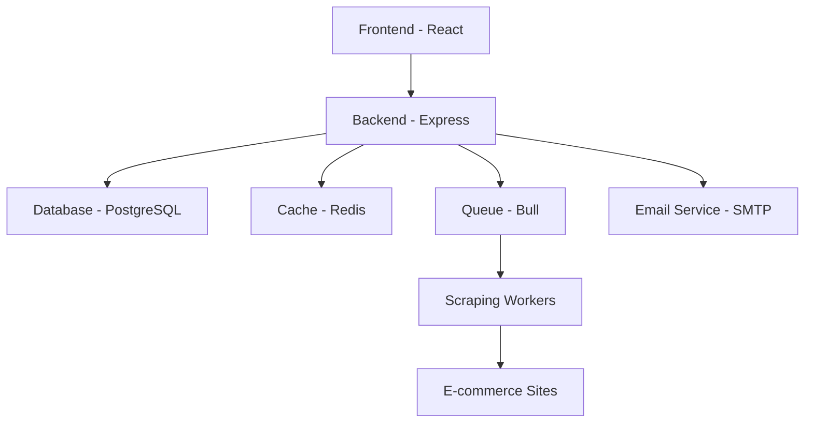

# Database: applying schema with Drizzle

- Development apply (non-interactive):

```bash
npm run db:push
```

- Studio (optional):

```bash
cd backend && npm run db:studio
```

## Start order and health checks

1) Start backend

```bash
npm run dev:backend
```

2) Start frontend

```bash
npm run dev:frontend
```

3) Health checks

```bash
curl http://localhost:3001/health
curl http://localhost:3001/api/anonymous-notifications/stats
```

> Monitoring endpoints are temporarily disabled and will be re-enabled later.

## Redis & Postgres

- Local Docker:

```bash
npm run db:start   # starts postgres & redis from docker-compose
```

- Or use your local Postgres/Redis instances; set `DB_*` and `REDIS_URL` envs accordingly.

## 🔄 Development Workflow

This document outlines the development workflow, best practices, and processes for the PricePulse project.

### 🎯 Development Philosophy

PricePulse follows a **simple, anonymous-first approach** where users can access all features without creating accounts. The system uses email-based management for price alerts, making it accessible to everyone while maintaining security.

### Core Principles

1. **Anonymous by Default**: No user accounts required for core functionality
2. **Email-Based Management**: Secure token-based management for price alerts
3. **Progressive Enhancement**: Start simple, add complexity only when needed
4. **User Experience First**: Prioritize ease of use over technical complexity
5. **Security Through Tokens**: Secure management without persistent authentication

## 🏗️ Architecture Overview

### System Components



### Data Flow

1. **User Search**: Frontend → Backend → Cache → Scraping Queue
2. **Price Alerts**: Frontend → Backend → Database → Email Service
3. **Real-time Updates**: WebSocket → Frontend (price changes, alerts)
4. **Alert Management**: Email Link → Frontend → Backend → Database

## 🚀 Getting Started

### Prerequisites

- Node.js 18+ and npm
- Docker and Docker Compose
- PostgreSQL 15+
- Redis 7+
- Git

### Initial Setup

```bash
# Clone repository
git clone https://github.com/ntanwir10/pricepulse.git
cd pricepulse

# Install dependencies
npm install

# Setup environment
npm run env:setup

# Start development environment
npm run dev
```

### Environment Configuration

```env
# Backend (.env)
NODE_ENV=development
PORT=3001
FRONTEND_URL=http://localhost:5173

# Database
DB_HOST=localhost
DB_PORT=5432
DB_USER=pricepulse
DB_PASSWORD=pricepulse123
DB_NAME=pricepulse

# Redis
REDIS_URL=redis://localhost:6379

# Email (for anonymous alerts)
SMTP_HOST=smtp.gmail.com
SMTP_PORT=587
SMTP_USER=your-email@gmail.com
SMTP_PASS=your-app-password
SMTP_FROM=noreply@pricepulse.com

# Scraping
SCRAPING_DELAY=1000
MAX_CONCURRENT_SCRAPES=3
SCRAPING_TIMEOUT=30000
```

## 🔄 Daily Development Workflow

### Morning Routine

```bash
# Start development environment
npm run db:start      # Start databases
npm run dev           # Start frontend + backend

# Check system health
curl http://localhost:3001/health
curl http://localhost:3001/api/monitoring/health
```

### Development Session

1. **Feature Development**
   - Create feature branch: `git checkout -b feature/anonymous-alerts`
   - Implement changes
   - Test locally
   - Commit with descriptive messages

2. **Testing**

   ```bash
   # Backend tests
   cd backend && npm run test
   
   # Frontend tests
   cd frontend && npm run test
   
   # Integration tests
   npm run test:integration
   ```

3. **Code Quality**

   ```bash
   # Linting
   npm run lint
   
   # Type checking
   npm run type-check
   
   # Format code
   npm run format
   ```

### End of Day

```bash
# Commit and push changes
git add .
git commit -m "feat: implement anonymous price alert management"
git push origin feature/anonymous-alerts

# Stop development environment (optional)
npm run db:stop
```

## 🧪 Testing Strategy

### Test Types

#### Unit Tests

- **Backend**: Services, repositories, utilities
- **Frontend**: Components, hooks, utilities
- **Coverage Target**: >85%

#### Integration Tests

- **API Endpoints**: Test complete request/response cycles
- **Database Operations**: Test data persistence and retrieval
- **Email Service**: Test notification delivery

#### E2E Tests

- **User Journeys**: Complete workflows from search to alert creation
- **Cross-browser**: Test in multiple browsers
- **Mobile**: Test responsive design

### Testing Commands

```bash
# Run all tests
npm run test

# Run specific test suites
npm run test:backend
npm run test:frontend
npm run test:e2e

# Watch mode for development
npm run test:watch

# Coverage report
npm run test:coverage
```

### Test Data Management

```typescript
// backend/src/test/setup.ts
export const testData = {
  products: [
    {
      id: 'test-product-1',
      name: 'Test Laptop',
      normalizedName: 'test laptop',
      category: 'electronics'
    }
  ],
  sources: [
    {
      id: 'test-source-1',
      name: 'Test Store',
      category: 'popular',
      configuration: { baseUrl: 'https://test-store.com' }
    }
  ]
}

// Seed test database
beforeEach(async () => {
  await seedTestDatabase(testData)
})

afterEach(async () => {
  await cleanupTestDatabase()
})
```

## 🔍 Code Quality Standards

### Code Style

#### TypeScript

- Strict mode enabled
- Explicit return types for public functions
- Interface over type aliases
- No `any` types without justification

#### React

- Functional components with hooks
- Props interface for each component
- Custom hooks for complex logic
- Memoization for expensive operations

#### Backend

- Service layer pattern
- Repository pattern for data access
- Comprehensive error handling
- Input validation with Zod

### Linting Rules

```json
// .eslintrc.json
{
  "extends": [
    "@typescript-eslint/recommended",
    "prettier"
  ],
  "rules": {
    "@typescript-eslint/no-unused-vars": "error",
    "@typescript-eslint/explicit-function-return-type": "warn",
    "prefer-const": "error",
    "no-var": "error"
  }
}
```

### Pre-commit Hooks

```json
// package.json
{
  "husky": {
    "hooks": {
      "pre-commit": "lint-staged",
      "commit-msg": "commitlint -E HUSKY_GIT_PARAMS"
    }
  },
  "lint-staged": {
    "*.{ts,tsx}": [
      "eslint --fix",
      "prettier --write"
    ]
  }
}
```

## 🗄️ Database Development

### Schema Changes

1. **Create Migration**

   ```bash
   cd backend
   npm run db:migrate:generate --name add_anonymous_alerts
   ```

2. **Review Migration**

   ```sql
   -- Check generated migration file
   -- Ensure proper constraints and indexes
   -- Test with sample data
   ```

3. **Apply Migration**

   ```bash
   npm run db:migrate:apply
   ```

4. **Update Schema Types**

   ```typescript
   // backend/src/database/schema.ts
   export const anonymousPriceAlerts = pgTable("anonymous_price_alerts", {
     id: uuid("id").primaryKey().defaultRandom(),
     email: text("email").notNull(),
     productId: uuid("product_id").notNull().references(() => products.id),
     // ... other fields
   })
   ```

### Data Seeding

```typescript
// backend/src/database/seed.ts
export async function seedDatabase() {
  // Seed products
  await db.insert(products).values([
    {
      name: 'MacBook Pro 13-inch',
      normalizedName: 'macbook pro 13 inch',
      category: 'electronics'
    }
  ])
  
  // Seed sources
  await db.insert(sources).values([
    {
      name: 'Amazon',
      category: 'popular',
      configuration: { baseUrl: 'https://amazon.com' }
    }
  ])
}
```

## 🔧 API Development

### Endpoint Structure

```typescript
// backend/src/routes/anonymousNotifications.ts
router.post('/alerts', async (req: Request, res: Response) => {
  try {
    // 1. Validate input
    const validatedData = createAlertSchema.parse(req.body)
    
    // 2. Business logic
    const alert = await anonymousNotificationService.createAlert(validatedData)
    
    // 3. Send email
    await emailService.sendVerificationEmail(alert)
    
    // 4. Return response
    res.status(201).json({
      message: 'Price alert created. Please check your email to verify.',
      alertId: alert.id
    })
  } catch (error) {
    // Error handling
    handleApiError(error, res)
  }
})
```

### Validation Schemas

```typescript
// backend/src/validation/schemas.ts
export const createAlertSchema = z.object({
  email: z.string().email('Valid email is required'),
  productId: z.string().uuid('Valid product ID is required'),
  targetPrice: z.number().positive('Target price must be positive'),
  currency: z.string().length(3, 'Currency must be 3 characters'),
  alertType: z.enum(['below', 'above', 'percentage']),
  threshold: z.number().optional()
})
```

### Error Handling

```typescript
// backend/src/middleware/errorHandler.ts
export const handleApiError = (error: unknown, res: Response) => {
  if (error instanceof ZodError) {
    return res.status(400).json({
      error: 'Validation Error',
      message: 'Invalid request data',
      details: error.errors
    })
  }
  
  if (error instanceof DatabaseError) {
    return res.status(500).json({
      error: 'Database Error',
      message: 'Failed to process request'
    })
  }
  
  // Default error
  return res.status(500).json({
    error: 'Internal Server Error',
    message: 'Something went wrong'
  })
}
```

## 🎨 Frontend Development

### Component Structure

```typescript
// frontend/src/components/AnonymousPriceAlert.tsx
interface AnonymousPriceAlertProps {
  product: Product
  onAlertCreated: (alert: AnonymousAlert) => void
}

export const AnonymousPriceAlert: React.FC<AnonymousPriceAlertProps> = ({
  product,
  onAlertCreated
}) => {
  const [email, setEmail] = useState('')
  const [targetPrice, setTargetPrice] = useState('')
  const [isSubmitting, setIsSubmitting] = useState(false)
  
  const handleSubmit = async (e: React.FormEvent) => {
    e.preventDefault()
    setIsSubmitting(true)
    
    try {
      const alert = await createAnonymousAlert({
        email,
        productId: product.id,
        targetPrice: parseFloat(targetPrice) * 100
      })
      
      onAlertCreated(alert)
      toast.success('Alert created! Check your email to verify.')
    } catch (error) {
      toast.error('Failed to create alert')
    } finally {
      setIsSubmitting(false)
    }
  }
  
  return (
    <form onSubmit={handleSubmit} className="space-y-4">
      {/* Form fields */}
    </form>
  )
}
```

### State Management

```typescript
// frontend/src/hooks/useAnonymousAlerts.ts
export const useAnonymousAlerts = () => {
  const [alerts, setAlerts] = useState<AnonymousAlert[]>([])
  const [loading, setLoading] = useState(false)
  
  const createAlert = async (alertData: CreateAlertData) => {
    setLoading(true)
    try {
      const response = await apiClient.post('/anonymous-notifications/alerts', alertData)
      const newAlert = response.data
      setAlerts(prev => [...prev, newAlert])
      return newAlert
    } finally {
      setLoading(false)
    }
  }
  
  const deleteAlert = async (managementToken: string) => {
    await apiClient.delete(`/anonymous-notifications/alerts/${managementToken}`)
    setAlerts(prev => prev.filter(alert => alert.managementToken !== managementToken))
  }
  
  return {
    alerts,
    loading,
    createAlert,
    deleteAlert
  }
}
```

### API Client

```typescript
// frontend/src/lib/api.ts
class ApiClient {
  private baseUrl: string
  
  constructor(baseUrl: string) {
    this.baseUrl = baseUrl
  }
  
  async request<T>(endpoint: string, options: RequestInit = {}): Promise<T> {
    const url = `${this.baseUrl}${endpoint}`
    
    const response = await fetch(url, {
      ...options,
      headers: {
        'Content-Type': 'application/json',
        ...options.headers
      }
    })
    
    if (!response.ok) {
      throw new ApiError(response.status, response.statusText)
    }
    
    return response.json()
  }
  
  async post<T>(endpoint: string, data: unknown): Promise<T> {
    return this.request<T>(endpoint, {
      method: 'POST',
      body: JSON.stringify(data)
    })
  }
  
  async get<T>(endpoint: string): Promise<T> {
    return this.request<T>(endpoint)
  }
}

export const apiClient = new ApiClient(import.meta.env.VITE_API_URL)
```

## 📧 Email Service Development

### Email Templates

```typescript
// backend/src/services/emailService.ts
export class EmailService {
  private transporter: Transporter
  
  constructor() {
    this.transporter = nodemailer.createTransporter({
      host: process.env.SMTP_HOST,
      port: parseInt(process.env.SMTP_PORT || '587'),
      secure: false,
      auth: {
        user: process.env.SMTP_USER,
        pass: process.env.SMTP_PASS
      }
    })
  }
  
  async sendVerificationEmail(alert: AnonymousAlert) {
    const template = this.getVerificationTemplate(alert)
    
    await this.transporter.sendMail({
      from: process.env.SMTP_FROM,
      to: alert.email,
      subject: 'Verify Your Price Alert',
      html: template
    })
  }
  
  private getVerificationTemplate(alert: AnonymousAlert): string {
    const verificationUrl = `${process.env.FRONTEND_URL}/verify/${alert.verificationToken}`
    const managementUrl = `${process.env.FRONTEND_URL}/manage/${alert.managementToken}`
    
    return `
      <h2>Verify Your Price Alert</h2>
      <p>Click the link below to verify your price alert:</p>
      <a href="${verificationUrl}">Verify Alert</a>
      <p>Or copy this link: ${verificationUrl}</p>
      <p>Once verified, you can manage your alert here: ${managementUrl}</p>
    `
  }
}
```

## 🔍 Debugging and Troubleshooting

### Common Issues

#### Database Connection

```bash
# Check database status
docker ps | grep postgres

# Connect to database
docker exec -it pricepulse-postgres-1 psql -U pricepulse -d pricepulse

# Check migrations
\dt
SELECT * FROM drizzle.__drizzle_migrations;
```

#### Redis Connection

```bash
# Check Redis status
docker ps | grep redis

# Connect to Redis
docker exec -it pricepulse-redis-1 redis-cli

# Check keys
KEYS *
```

#### Email Service

```bash
# Check SMTP configuration
cd backend
npm run test:email

# Test email sending
curl -X POST http://localhost:3001/api/test/email \
  -H "Content-Type: application/json" \
  -d '{"to": "test@example.com", "subject": "Test", "body": "Test email"}'
```

### Logging

```typescript
// backend/src/middleware/logger.ts
export const logger = (req: Request, res: Response, next: NextFunction) => {
  const start = Date.now()
  
  res.on('finish', () => {
    const duration = Date.now() - start
    console.log(`${req.method} ${req.path} - ${res.statusCode} - ${duration}ms`)
  })
  
  next()
}
```

### Performance Monitoring

```typescript
// backend/src/services/monitoringService.ts
export class MonitoringService {
  trackApiCall(endpoint: string, duration: number, status: number) {
    // Track API performance
    this.metrics.apiCalls.push({
      endpoint,
      duration,
      status,
      timestamp: new Date()
    })
  }
  
  trackDatabaseQuery(query: string, duration: number) {
    // Track database performance
    this.metrics.databaseQueries.push({
      query,
      duration,
      timestamp: new Date()
    })
  }
}
```

## 🚀 Deployment

### Development Deployment

```bash
# Build and start
npm run build:dev
npm run start:dev

# Or use Docker
docker-compose up --build
```

### Production Deployment

```bash
# Build production
npm run build:prod

# Deploy
npm run deploy

# Or manual deployment
docker-compose -f docker-compose.prod.yml up -d
```

### Environment Management

```bash
# Switch to production
npm run env:prod

# Check current environment
npm run env:status

# Update production config
npm run env:update:prod
```

## 📚 Documentation

### Code Documentation

```typescript
/**
 * Creates an anonymous price alert for a product
 * 
 * @param email - User's email address for notifications
 * @param productId - ID of the product to track
 * @param targetPrice - Target price in cents (e.g., 99999 for $999.99)
 * @param currency - Currency code (default: USD)
 * @param alertType - Type of alert (below, above, percentage)
 * @param threshold - Threshold for percentage-based alerts
 * 
 * @returns Promise<AnonymousAlert> - Created alert with management tokens
 * 
 * @example
 * const alert = await createAnonymousAlert({
 *   email: 'user@example.com',
 *   productId: 'product-uuid',
 *   targetPrice: 99999,
 *   alertType: 'below'
 * })
 */
async function createAnonymousAlert(
  email: string,
  productId: string,
  targetPrice: number,
  currency: string = 'USD',
  alertType: AlertType = 'below',
  threshold?: number
): Promise<AnonymousAlert> {
  // Implementation
}
```

### API Documentation

- Keep API reference updated
- Include examples for all endpoints
- Document error codes and responses
- Provide SDK examples

### User Documentation

- Clear setup instructions
- Feature explanations
- Troubleshooting guides
- FAQ section

## 🔄 Continuous Integration

### GitHub Actions

```yaml
# .github/workflows/ci.yml
name: CI/CD Pipeline

on: [push, pull_request]

jobs:
  test:
    runs-on: ubuntu-latest
    steps:
      - uses: actions/checkout@v3
      - uses: actions/setup-node@v3
        with:
          node-version: '18'
      - run: npm ci
      - run: npm run test
      - run: npm run test:coverage
      - run: npm run lint
      - run: npm run type-check
```

### Pre-commit Checks

```bash
# Install pre-commit hooks
npm run install:hooks

# Run all checks
npm run pre-commit

# Check specific areas
npm run lint
npm run type-check
npm run test:unit
```

## 📊 Monitoring and Analytics

### Application Metrics

- API response times
- Database query performance
- Cache hit rates
- Error rates and types

### Business Metrics

- Search queries per day
- Price alerts created
- Alert conversion rates
- User engagement patterns

### Alerting

- System health monitoring
- Performance degradation alerts
- Error rate thresholds
- Database connection issues

## 🆘 Support and Troubleshooting

### Getting Help

1. **Check Documentation**: Start with this document and API reference
2. **Search Issues**: Look for similar problems in GitHub issues
3. **Create Issue**: Provide detailed error information and steps to reproduce
4. **Community**: Use GitHub Discussions for questions

### Issue Templates

```markdown
## Bug Report

**Description**: Brief description of the issue

**Steps to Reproduce**:
1. Step 1
2. Step 2
3. Step 3

**Expected Behavior**: What should happen

**Actual Behavior**: What actually happens

**Environment**:
- OS: [e.g., macOS 14.0]
- Node.js: [e.g., 18.17.0]
- Database: [e.g., PostgreSQL 15]

**Additional Context**: Any other relevant information
```

### Feature Requests

```markdown
## Feature Request

**Description**: Brief description of the feature

**Use Case**: Why this feature is needed

**Proposed Solution**: How you think it should work

**Alternatives**: Any alternative solutions considered

**Additional Context**: Any other relevant information
```

This development workflow ensures consistent, high-quality development while maintaining the anonymous-first philosophy of PricePulse.
