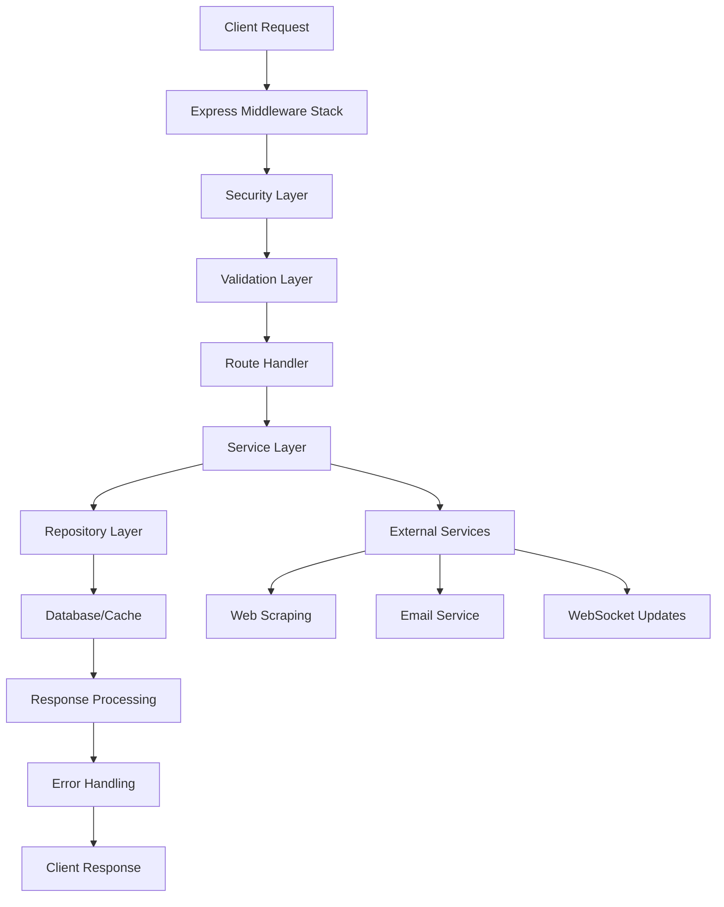

# Backend Logic Flow Analysis

**Generated**: August 22, 2025  
**Status**: Analysis Complete - Implementation Planning Phase  
**Version**: 1.0

## 📋 Table of Contents

- [Backend Logic Flow Analysis](#backend-logic-flow-analysis)
  - [📋 Table of Contents](#-table-of-contents)
  - [🔍 Backend Logic Flow Analysis](#-backend-logic-flow-analysis)
  - [📊 Current Request Flow Architecture](#-current-request-flow-architecture)
  - [🎯 Key Logic Flow Patterns Identified](#-key-logic-flow-patterns-identified)
    - [1. 🔍 Search Request Flow](#1--search-request-flow)
    - [2. 🤖 Web Scraping Logic Flow](#2--web-scraping-logic-flow)
    - [3. 🔔 Anonymous Alert System Flow](#3--anonymous-alert-system-flow)
    - [4. 🌐 WebSocket Real-time Flow](#4--websocket-real-time-flow)
  - [🚀 Logic Flow Optimization Opportunities](#-logic-flow-optimization-opportunities)
  - [🔧 Critical Logic Flow Issues \& Solutions](#-critical-logic-flow-issues--solutions)
  - [🎯 Immediate Action Items for Logic Flow](#-immediate-action-items-for-logic-flow)
  - [📊 Logic Flow Success Metrics](#-logic-flow-success-metrics)

## 🔍 Backend Logic Flow Analysis

### **📊 Current Request Flow Architecture**



**Middleware Stack Flow:**
1. **Security Headers** → Helmet, CORS, CSP
2. **Rate Limiting** → Express rate limiter (100 req/15min)
3. **Request Parsing** → JSON body parser, sanitization
4. **Authentication** → JWT validation (when enabled)
5. **Validation** → Zod schema validation
6. **Business Logic** → Service layer processing
7. **Error Handling** → Centralized error middleware

## 🎯 Key Logic Flow Patterns Identified

### 1. 🔍 Search Request Flow

**Current Flow:**
```
POST /api/search → Validation → SearchService.search() → Cache Check → 
Active Search Deduplication → ScrapingService → Source Repository → 
Database Queries → Response Aggregation → Cache Storage → Client Response
```

**✅ Strengths:**
- **Smart deduplication** prevents duplicate searches using in-memory Map
- **Multi-layer caching** (Redis + in-memory activeSearches)
- **Graceful fallback** to mock data when scraping fails
- **Staggered source scraping** (500ms delay) to prevent thundering herd
- **Comprehensive error handling** with structured responses

**⚠️ Areas for Improvement:**
- **In-memory activeSearches Map** won't scale across multiple instances
- **Sequential source processing** could be optimized with better parallelization
- **No search result ranking** algorithm based on relevance or quality
- **Limited search analytics** tracking for optimization

**Detailed Flow Analysis:**
```typescript
// 1. Request Validation
const searchValidation = [
  body("query").isString().trim().isLength({ min: 1, max: 500 }),
  body("maxResults").optional().isInt({ min: 1, max: 100 }),
  body("filters").optional().isObject(),
  body("sort").optional().isObject(),
];

// 2. Search Deduplication Logic
const searchKey = `search:${JSON.stringify({
  query: request.query.toLowerCase().trim(),
  filters: request.filters || null,
  sort: request.sort || null,
  sources: request.sources || null,
  maxResults: request.maxResults || 50
})}`;

// 3. Cache Check Pattern
const cachedResult = await cachingService.get<SearchResponse>(
  request.query, request.filters, request.sort, request.sources
);

// 4. Active Search Coordination
if (this.activeSearches.has(searchKey)) {
  const existingSearch = this.activeSearches.get(searchKey);
  return await existingSearch; // Wait for existing search
}
```

### 2. 🤖 Web Scraping Logic Flow

**Current Flow:**
```
ScrapingService.scrapeSource() → Browser Initialization → 
Source Configuration → Page Navigation → Content Extraction → 
Data Transformation → Fallback to Mock Data → Result Caching
```

**✅ Strengths:**
- **Robust error handling** with comprehensive fallback mechanisms
- **Browser resource management** with proper cleanup in finally blocks
- **Concurrency control** using semaphore pattern to prevent resource exhaustion
- **Configurable scraping parameters** via environment variables
- **Automatic mock data fallback** when real scraping fails

**⚠️ Areas for Improvement:**
- **Browser initialization overhead** - new browser instance for each scrape
- **No proxy rotation** for rate limit avoidance
- **Limited content validation** mechanisms
- **No adaptive scraping strategies** based on source reliability

**Detailed Flow Analysis:**
```typescript
// 1. Browser Initialization Pattern
async initializeBrowser(): Promise<void> {
  if (this.browserLock) {
    while (this.browserLock) {
      await new Promise(resolve => setTimeout(resolve, 100));
    }
    return;
  }
  
  this.browserLock = true;
  // Browser launch with comprehensive configuration
}

// 2. Concurrency Control
private concurrencySlots = 0;
private readonly MAX_CONCURRENT_SCRAPES = 3;

private async acquireConcurrencySlot(): Promise<void> {
  while (this.concurrencySlots >= this.MAX_CONCURRENT_SCRAPES) {
    await new Promise(resolve => setTimeout(resolve, 1000));
  }
  this.concurrencySlots++;
}

// 3. Fallback Strategy
catch (error) {
  logger.error(`Failed to scrape source ${source.name}: ${errorMessage}`);
  logger.warn(`Falling back to mock data for source: ${source.name}`);
  return this.generateMockScrapingResult(sourceId, query);
}
```

### 3. 🔔 Anonymous Alert System Flow

**Current Flow:**
```
Create Alert → Email Validation → Token Generation → 
Database Storage → Email Verification → Alert Activation → 
Price Monitoring → Notification Triggering
```

**✅ Strengths:**
- **Secure token-based verification** system with unique tokens
- **Email-based management** without requiring user accounts
- **Comprehensive alert configuration** options (below, above, percentage)
- **Automatic cleanup** of expired tokens via scheduled job
- **Duplicate prevention** via unique constraints

**⚠️ Areas for Improvement:**
- **No batch processing** for price checks across multiple alerts
- **Limited alert intelligence** (no optimal timing optimization)
- **No alert frequency management** to prevent spam
- **Missing alert analytics** and effectiveness tracking

**Detailed Flow Analysis:**
```typescript
// 1. Alert Creation with Token Generation
const verificationToken = crypto.randomBytes(32).toString('hex');
const managementToken = crypto.randomBytes(32).toString('hex');

// 2. Database Storage with Constraints
const [newAlert] = await getDb()
  .insert(anonymousPriceAlerts)
  .values({
    email: data.email,
    productId: data.productId,
    targetPrice: data.targetPrice,
    verificationToken,
    managementToken,
    isVerified: false,
    isActive: true,
  })
  .returning();

// 3. Email Verification Flow
await this.emailService.sendVerificationEmail({
  id: newAlert.id,
  email: newAlert.email,
  verificationToken: newAlert.verificationToken,
  managementToken: newAlert.managementToken,
});

// 4. Automatic Cleanup Job
setInterval(async () => {
  const svc = new AnonymousNotificationService();
  const removed = await svc.cleanupExpiredTokens();
}, 6 * 60 * 60 * 1000); // Every 6 hours
```

### 4. 🌐 WebSocket Real-time Flow

**Current Flow:**
```
Client Connection → Authentication Check → Rate Limiting → 
Message Processing → Subscription Management → 
Real-time Updates → Connection Health Monitoring
```

**✅ Strengths:**
- **JWT-based authentication** for WebSocket connections
- **Per-connection rate limiting** (100 messages/minute)
- **Automatic connection cleanup** on disconnect
- **Ping/pong health checks** every 30 seconds
- **Message size validation** and error handling

**⚠️ Areas for Improvement:**
- **No clustering support** for multi-instance deployments
- **Limited subscription management** capabilities
- **No message persistence** for offline clients
- **Basic connection scaling** without load balancing

**Detailed Flow Analysis:**
```typescript
// 1. Connection Authentication
ws.on("message", (message: Buffer) => {
  // Check message size
  if (message.length > this.MAX_PAYLOAD_SIZE) {
    ws.close(1009, "Message too large");
    return;
  }
  
  // Check rate limiting
  if (!this.checkRateLimit(clientId)) {
    this.sendToClient(clientId, {
      type: "error",
      data: { message: "Rate limit exceeded" },
      timestamp: new Date(),
    });
    return;
  }
});

// 2. Health Check System
const pingInterval = setInterval(() => {
  if (ws.readyState === WebSocket.OPEN) {
    ws.ping();
  }
}, 30000);

// 3. Subscription Management
private clientSubscriptions: Map<string, Set<string>> = new Map();
private productSubscriptions: Map<string, Set<string>> = new Map();
```

## 🚀 Logic Flow Optimization Opportunities

### **Phase 1: Performance & Scalability (Immediate)**

#### **1.1 Search Flow Optimization**
```typescript
// Current Issue: In-memory search deduplication
private activeSearches: Map<string, Promise<SearchResponse>> = new Map();

// Proposed Solution: Redis-based distributed search coordination
interface DistributedSearchCoordination {
  searchLocks: 'Redis-based search locks for deduplication',
  resultStreaming: 'Stream search results as they arrive',
  progressTracking: 'Real-time search progress updates',
  resultRanking: 'ML-based result ranking algorithms'
}

// Implementation Plan:
// 1. Replace Map with Redis-based coordination
// 2. Add search result streaming via WebSocket
// 3. Implement progressive result delivery
// 4. Add search analytics and optimization
```

#### **1.2 Scraping Flow Enhancement**
```typescript
// Current Issue: Browser initialization overhead
await puppeteer.launch() // Called for each scrape

// Proposed Solution: Browser pool management
interface BrowserPoolManagement {
  browserPool: 'Maintain pool of warm browser instances',
  sessionReuse: 'Reuse browser sessions across scrapes',
  resourceOptimization: 'Optimize browser resource usage',
  adaptiveScraping: 'Dynamic scraping strategy based on source health'
}

// Implementation Plan:
// 1. Create browser instance pool (3-5 instances)
// 2. Implement browser health monitoring
// 3. Add automatic browser recycling
// 4. Implement adaptive scraping strategies
```

#### **1.3 Caching Strategy Optimization**
```typescript
// Current: Basic Redis caching
await cachingService.get(query, filters, sort, sources)

// Proposed: Multi-layer intelligent caching
interface IntelligentCaching {
  L1Cache: 'In-memory LRU cache for hot searches',
  L2Cache: 'Redis cache with smart TTL management',
  L3Cache: 'Database query result caching',
  cacheWarming: 'Predictive cache warming based on patterns'
}

// Implementation Plan:
// 1. Add in-memory LRU cache for frequent searches
// 2. Implement intelligent TTL based on data freshness
// 3. Add cache warming for popular searches
// 4. Implement cache hit ratio optimization
```

### **Phase 2: Business Logic Enhancement (Short-term)**

#### **2.1 Smart Alert Processing**
```typescript
// Current: Individual alert processing
await this.checkPriceAlert(alert)

// Proposed: Batch intelligent processing
interface SmartAlertProcessing {
  batchProcessing: 'Process multiple alerts efficiently',
  alertIntelligence: 'ML-based optimal notification timing',
  priceForecasting: 'Predict price trends for better alerts',
  userBehaviorAnalysis: 'Optimize alert frequency based on engagement'
}

// Implementation Plan:
// 1. Implement batch alert processing
// 2. Add intelligent notification timing
// 3. Create price trend analysis
// 4. Add alert effectiveness tracking
```

#### **2.2 Advanced Search Intelligence**
```typescript
// Current: Basic text matching
query.toLowerCase().trim()

// Proposed: Intelligent search processing
interface SearchIntelligence {
  semanticSearch: 'Vector-based semantic product matching',
  autoComplete: 'Real-time search suggestions',
  searchAnalytics: 'Track and optimize search patterns',
  personalizedResults: 'User behavior-based result ranking'
}

// Implementation Plan:
// 1. Implement full-text search with PostgreSQL
// 2. Add search suggestion engine
// 3. Create search analytics dashboard
// 4. Implement result ranking algorithms
```

### **Phase 3: Architecture Evolution (Medium-term)**

#### **3.1 Event-Driven Architecture**
```typescript
// Current: Direct service calls
await scrapingService.scrapeSource(sourceId, query)

// Proposed: Event-driven processing
interface EventDrivenArchitecture {
  eventBus: 'Central event bus for service communication',
  asyncProcessing: 'Asynchronous job processing with queues',
  eventSourcing: 'Event sourcing for audit trails',
  sagaPattern: 'Distributed transaction management'
}

// Implementation Plan:
// 1. Implement event bus with Redis Streams
// 2. Add async job processing with Bull Queue
// 3. Create event sourcing for price changes
// 4. Implement saga pattern for complex workflows
```

#### **3.2 Microservices Preparation**
```typescript
// Current: Monolithic service layer
class SearchService, ScrapingService, NotificationService

// Proposed: Service decomposition readiness
interface MicroservicesReadiness {
  serviceInterfaces: 'Well-defined service boundaries',
  apiGateways: 'Centralized API gateway pattern',
  serviceDiscovery: 'Dynamic service discovery mechanism',
  circuitBreakers: 'Fault tolerance patterns'
}

// Implementation Plan:
// 1. Define clear service boundaries
// 2. Implement API gateway pattern
// 3. Add service health checks
// 4. Create circuit breaker patterns
```

## 🔧 Critical Logic Flow Issues & Solutions

### **1. 🚨 Concurrency & Race Conditions**

**Issue**: Multiple concurrent searches for same query
```typescript
// Current race condition risk
if (this.activeSearches.has(searchKey)) {
  const existingSearch = this.activeSearches.get(searchKey);
  // Race condition: search might complete between check and get
}
```

**Solution**: Atomic operations with Redis
```typescript
// Proposed atomic search coordination
const searchLock = await redis.set(`search:lock:${searchKey}`, clientId, 'PX', 30000, 'NX');
if (!searchLock) {
  // Another instance is handling this search
  return await this.waitForSearchResult(searchKey);
}
```

### **2. 🔄 Resource Management Issues**

**Issue**: Browser resource leaks
```typescript
// Current: Browser instances may not be properly cleaned up
this.browser = await puppeteer.launch();
// If error occurs, browser might not be closed
```

**Solution**: Resource pool with automatic cleanup
```typescript
// Proposed browser pool management
class BrowserPool {
  private browsers: Browser[] = [];
  private maxBrowsers = 3;
  
  async getBrowser(): Promise<Browser> {
    // Return available browser or create new one
  }
  
  async releaseBrowser(browser: Browser): Promise<void> {
    // Return browser to pool or close if pool is full
  }
}
```

### **3. 📊 Data Consistency Issues**

**Issue**: Cache invalidation complexity
```typescript
// Current: Manual cache invalidation
await cachingService.invalidate(pattern);
// No guarantee of consistency across cache layers
```

**Solution**: Event-driven cache invalidation
```typescript
// Proposed event-driven cache management
eventBus.emit('price.updated', { productId, newPrice });
// All cache layers listen and invalidate appropriately
```

## 🎯 Immediate Action Items for Logic Flow

### **High Priority (Next 2 Weeks)**

1. **Implement Redis-based search coordination**
   - Replace in-memory activeSearches Map
   - Add distributed search locks
   - Implement search result streaming

2. **Add browser pool management**
   - Create browser instance pool
   - Implement proper resource cleanup
   - Add browser health monitoring

3. **Enhance error handling consistency**
   - Standardize error response format
   - Add correlation IDs for request tracking
   - Implement circuit breaker patterns

### **Medium Priority (Weeks 3-4)**

1. **Implement event-driven price monitoring**
   - Create price change event system
   - Add batch alert processing
   - Implement smart notification timing

2. **Add comprehensive request tracing**
   - Implement distributed tracing
   - Add performance monitoring
   - Create request flow visualization

3. **Optimize database query patterns**
   - Add query performance monitoring
   - Implement connection pooling optimization
   - Add database health checks

### **Low Priority (Weeks 5-8)**

1. **Implement advanced caching strategies**
   - Add predictive cache warming
   - Implement cache hit ratio optimization
   - Add cache performance analytics

2. **Add business logic analytics**
   - Track search patterns and success rates
   - Monitor alert effectiveness
   - Implement A/B testing framework

## 📊 Logic Flow Success Metrics

### **Performance Metrics**
- **Search Response Time**: Target < 500ms for cached, < 3s for fresh
- **Cache Hit Rate**: Target > 90% for repeated searches
- **Browser Pool Efficiency**: Target > 95% resource utilization
- **Error Rate**: Target < 0.5% across all flows

### **Business Logic Metrics**
- **Search Success Rate**: Target > 98% successful searches
- **Alert Accuracy**: Target > 99% accurate price notifications
- **Real-time Update Latency**: Target < 100ms for WebSocket updates
- **Resource Utilization**: Target < 70% CPU/Memory usage

### **Quality Metrics**
- **Code Coverage**: Target > 85% for critical logic flows
- **Error Recovery Rate**: Target > 95% successful error recovery
- **Data Consistency**: Target 100% cache consistency
- **Security Compliance**: Target 0 critical security vulnerabilities

---

**Note**: This analysis is based on the current codebase as of August 22, 2025. The logic flow is well-structured with good separation of concerns, but has several scalability and performance optimization opportunities. The main focus should be on distributed coordination, resource management, and event-driven architecture patterns.
