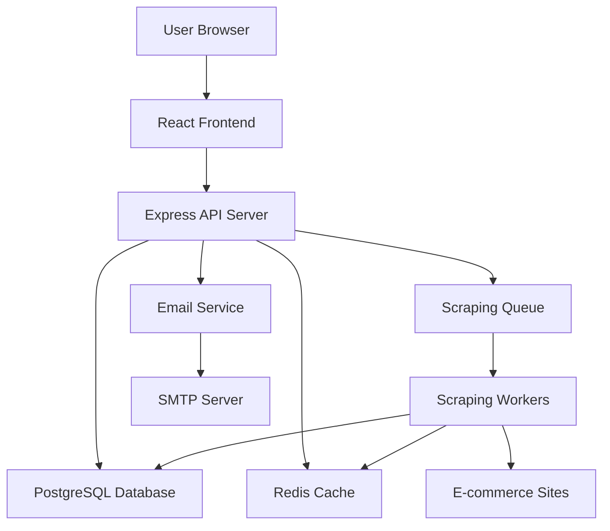
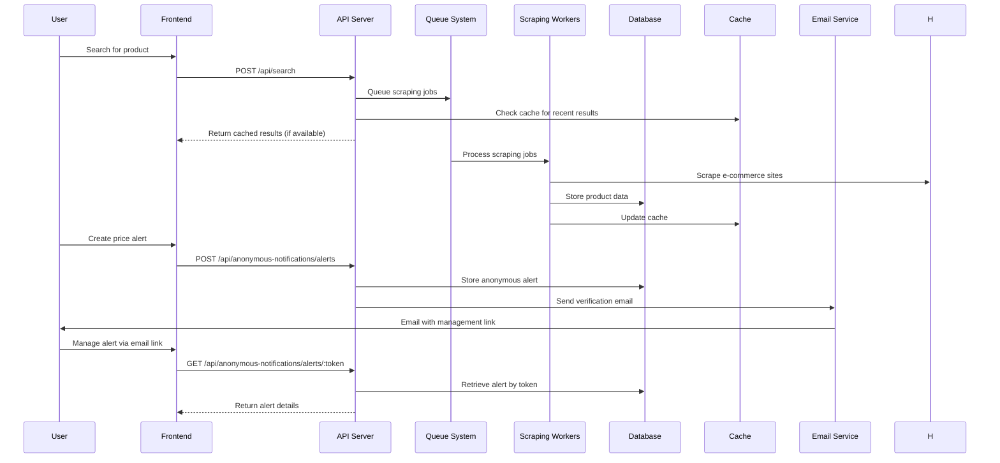
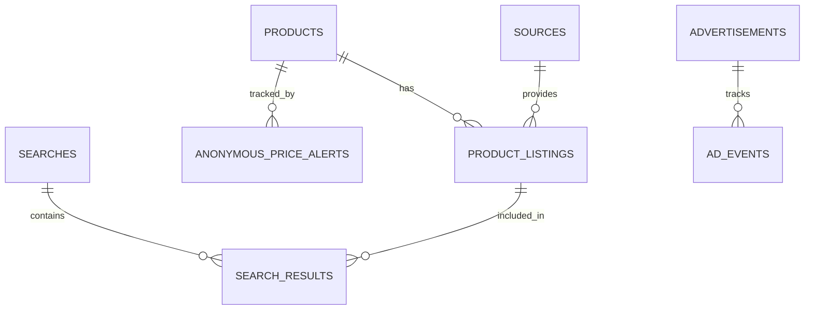

# 🏗️ Project Plan & Architecture

This document provides a comprehensive overview of the PricePulse project architecture, implementation details, and development roadmap.

## 🎯 Project Overview

### Summary

PricePulse is a full-stack web application that enables users to search for products across multiple online sources and compare prices in real-time. The application scrapes and aggregates product information from various e-commerce sites, providing users with comprehensive price comparisons, sorting capabilities, and real-time price updates. **The system works completely without user accounts or authentication, using email-based management for price alerts.**

### Goals

- Provide a centralized platform for users to find the best prices for products online
- Deliver a fast, accurate, and user-friendly experience across all devices
- Build a scalable and maintainable application with comprehensive error handling
- Implement an advertisement system for revenue generation
- Create a robust web scraping infrastructure that respects rate limits and handles failures gracefully
- Enable anonymous price alerts with email-based management system

## 🏗️ Architecture

### High-Level Architecture



### Component Interaction Flow



### Backend Architecture

- **Services**: Business logic layer (Search, Scraping, Anonymous Notifications, Queue)
- **Repositories**: Data access layer with Drizzle ORM
- **Middleware**: CORS, rate limiting, error handling, validation
- **Queue System**: Bull Queue for background job processing
- **Email Service**: SMTP-based email notifications for anonymous alerts

### Frontend Architecture

- **Components**: Reusable UI components with shadcn/ui
- **Pages**: Main application views (no authentication required)
- **Hooks**: Custom React hooks for state management
- **API Client**: Centralized API communication
- **Types**: Comprehensive TypeScript type definitions

## 🛠️ Technology Stack

### Backend

- **Runtime**: Node.js with TypeScript
- **Framework**: Express.js
- **Database**: PostgreSQL with Drizzle ORM
- **Caching**: Redis
- **Queue**: Bull Queue
- **Web Scraping**: Puppeteer for dynamic content, Cheerio for static HTML parsing
- **Validation**: Zod schemas
- **Testing**: Vitest
- **Email**: SMTP service for anonymous notifications

### Frontend

- **Framework**: React 19 with TypeScript
- **Build Tool**: Vite
- **Styling**: Tailwind CSS with shadcn/ui component library
- **State Management**: React hooks with local and global state
- **Testing**: Vitest + React Testing Library

### Infrastructure

- **Containerization**: Docker + Docker Compose
- **Database**: PostgreSQL 15
- **Cache**: Redis 7
- **Development**: Hot reloading, TypeScript compilation

## 📊 Database Design

### Core Tables

#### Products

```sql
CREATE TABLE products (
  id UUID PRIMARY KEY DEFAULT gen_random_uuid(),
  name VARCHAR(500) NOT NULL,
  normalized_name VARCHAR(500) NOT NULL UNIQUE,
  category VARCHAR(100),
  specifications JSONB,
  created_at TIMESTAMP DEFAULT NOW(),
  updated_at TIMESTAMP DEFAULT NOW()
);
```

#### Product Listings

```sql
CREATE TABLE product_listings (
  id UUID PRIMARY KEY DEFAULT gen_random_uuid(),
  product_id UUID REFERENCES products(id) ON DELETE CASCADE,
  source_id UUID REFERENCES sources(id) ON DELETE CASCADE,
  url TEXT NOT NULL,
  price INTEGER NOT NULL, -- Store in cents to avoid floating point issues
  currency VARCHAR(3) DEFAULT 'USD',
  availability availability_enum NOT NULL DEFAULT 'unknown',
  image_url TEXT,
  rating INTEGER,
  review_count INTEGER,
  last_scraped TIMESTAMP NOT NULL DEFAULT NOW(),
  is_valid BOOLEAN NOT NULL DEFAULT TRUE,
  created_at TIMESTAMP DEFAULT NOW(),
  updated_at TIMESTAMP DEFAULT NOW(),
  
  -- Ensure unique listings per product/source/url
  UNIQUE(product_id, source_id, url)
);
```

#### Anonymous Price Alerts

```sql
CREATE TABLE anonymous_price_alerts (
  id UUID PRIMARY KEY DEFAULT gen_random_uuid(),
  email TEXT NOT NULL,
  product_id UUID NOT NULL REFERENCES products(id) ON DELETE CASCADE,
  target_price INTEGER NOT NULL, -- Store in cents
  currency VARCHAR(3) NOT NULL DEFAULT 'USD',
  alert_type TEXT NOT NULL DEFAULT 'below', -- below, above, percentage
  threshold INTEGER, -- For percentage-based alerts
  verification_token TEXT NOT NULL UNIQUE,
  management_token TEXT NOT NULL UNIQUE,
  is_verified BOOLEAN NOT NULL DEFAULT FALSE,
  is_active BOOLEAN NOT NULL DEFAULT TRUE,
  created_at TIMESTAMP DEFAULT NOW(),
  updated_at TIMESTAMP DEFAULT NOW()
);

-- Indexes for performance
CREATE INDEX idx_anonymous_alerts_email ON anonymous_price_alerts(email);
CREATE INDEX idx_anonymous_alerts_product ON anonymous_price_alerts(product_id);
CREATE INDEX idx_anonymous_alerts_verified ON anonymous_price_alerts(is_verified, is_active);
CREATE INDEX idx_anonymous_alerts_management ON anonymous_price_alerts(management_token);
```

#### Sources

```sql
CREATE TABLE sources (
  id UUID PRIMARY KEY DEFAULT gen_random_uuid(),
  name VARCHAR(100) NOT NULL,
  category source_category_enum NOT NULL DEFAULT 'alternative',
  is_active BOOLEAN NOT NULL DEFAULT TRUE,
  last_successful_scrape TIMESTAMP,
  error_count INTEGER NOT NULL DEFAULT 0,
  average_response_time INTEGER,
  configuration JSONB NOT NULL,
  created_at TIMESTAMP DEFAULT NOW(),
  updated_at TIMESTAMP DEFAULT NOW()
);
```

#### Searches

```sql
CREATE TABLE searches (
  id UUID PRIMARY KEY DEFAULT gen_random_uuid(),
  query TEXT NOT NULL,
  metadata JSONB NOT NULL, -- Store search metadata as JSON
  created_at TIMESTAMP DEFAULT NOW()
);
```

#### Search Results

```sql
CREATE TABLE search_results (
  id UUID PRIMARY KEY DEFAULT gen_random_uuid(),
  search_id UUID NOT NULL REFERENCES searches(id) ON DELETE CASCADE,
  product_listing_id UUID NOT NULL REFERENCES product_listings(id) ON DELETE CASCADE,
  rank INTEGER NOT NULL,
  created_at TIMESTAMP DEFAULT NOW()
);
```

#### Advertisements

```sql
CREATE TABLE advertisements (
  id UUID PRIMARY KEY DEFAULT gen_random_uuid(),
  title VARCHAR(200) NOT NULL,
  description TEXT NOT NULL,
  image_url TEXT NOT NULL,
  target_url TEXT NOT NULL,
  category VARCHAR(100) NOT NULL,
  keywords TEXT[] NOT NULL,
  is_active BOOLEAN NOT NULL DEFAULT TRUE,
  impressions INTEGER NOT NULL DEFAULT 0,
  clicks INTEGER NOT NULL DEFAULT 0,
  created_at TIMESTAMP DEFAULT NOW(),
  expires_at TIMESTAMP
);
```

### Database Relationships



### Data Duplication Prevention

The database includes several constraints and indexes to prevent data duplication:

```sql
-- Product name uniqueness
ALTER TABLE products ADD CONSTRAINT products_normalized_name_unique UNIQUE (normalized_name);

-- Unique listings per product/source/url
ALTER TABLE product_listings ADD CONSTRAINT product_listings_unique_per_source UNIQUE (product_id, source_id, url);

-- Anonymous alert management token uniqueness
CREATE UNIQUE INDEX anonymous_alerts_management_token_unique ON anonymous_price_alerts(management_token);

-- Verification token uniqueness
CREATE UNIQUE INDEX anonymous_alerts_verification_token_unique ON anonymous_price_alerts(verification_token);

-- Performance indexes
CREATE INDEX idx_product_listings_product ON product_listings(product_id);
CREATE INDEX idx_product_listings_source ON product_listings(source_id);
CREATE INDEX idx_products_normalized_name ON products(normalized_name);
CREATE INDEX idx_anonymous_alerts_email ON anonymous_alerts(email);
CREATE INDEX idx_anonymous_alerts_product ON anonymous_alerts(product_id);
```

## 🔍 Core Features Implementation

### Product Search System

#### Search Flow

1. **Query Processing**: Parse and validate search query
2. **Cache Check**: Look for recent results in Redis
3. **Source Selection**: Choose relevant e-commerce sources
4. **Job Queue**: Add scraping jobs to Bull Queue
5. **Result Aggregation**: Combine results from multiple sources
6. **Caching**: Store results in Redis for future requests

#### Search Algorithm

```typescript
interface SearchAlgorithm {
  // Query preprocessing
  preprocessQuery(query: string): ProcessedQuery;
  
  // Source selection based on query
  selectSources(query: ProcessedQuery): Source[];
  
  // Result ranking and scoring
  rankResults(results: Product[], query: ProcessedQuery): RankedProduct[];
  
  // Deduplication across sources
  deduplicateProducts(products: RankedProduct[]): DeduplicatedProduct[];
}
```

### Anonymous Price Alert System

#### Alert Creation Flow

1. **User Input**: User provides email, product, and target price
2. **Alert Creation**: System creates alert with verification and management tokens
3. **Email Verification**: Send verification email with management link
4. **Alert Activation**: Alert becomes active after email verification
5. **Price Monitoring**: System monitors prices and triggers alerts
6. **Notification**: Send email notification when price target is met

#### Alert Management

```typescript
interface AnonymousAlertService {
  // Create new anonymous alert
  createAlert(email: string, productId: string, targetPrice: number): Promise<AnonymousAlert>;
  
  // Verify alert via email token
  verifyAlert(verificationToken: string): Promise<boolean>;
  
  // Get alert details for management
  getAlertByManagementToken(managementToken: string): Promise<AnonymousAlert | null>;
  
  // Update alert settings
  updateAlert(managementToken: string, updates: Partial<AnonymousAlert>): Promise<AnonymousAlert>;
  
  // Delete alert
  deleteAlert(managementToken: string): Promise<void>;
  
  // Check if price alert should be triggered
  checkPriceAlert(alertId: string, currentPrice: number): Promise<boolean>;
  
  // Send notification for triggered alert
  sendPriceAlertNotification(alertId: string, currentPrice: number): Promise<void>;
}
```

### Web Scraping Infrastructure

#### Scraping Strategy

- **Rate Limiting**: Respect robots.txt and implement delays
- **Error Handling**: Graceful degradation for failed sources
- **Data Validation**: Ensure scraped data meets quality standards
- **Fallback Mechanisms**: Multiple scraping approaches per source

#### Scraping Workers

```typescript
interface ScrapingWorker {
  // Process scraping job
  processJob(job: ScrapingJob): Promise<ScrapingResult>;
  
  // Handle different source types
  scrapeSource(source: Source, query: string): Promise<Product[]>;
  
  // Data extraction and cleaning
  extractProductData(html: string, source: Source): Product[];
  
  // Error handling and retry logic
  handleError(error: Error, job: ScrapingJob): Promise<void>;
}
```

### Caching Strategy

#### Redis Cache Structure

- **Search Results**: 15-minute TTL for search queries
- **Product Data**: 1-hour TTL for individual products
- **Source Health**: 5-minute TTL for source status
- **Rate Limiting**: Per-IP rate limit counters

#### Cache Invalidation

```typescript
interface CacheManager {
  // Get cached results
  getCachedResults(query: string): Promise<SearchResult | null>;
  
  // Store search results
  cacheResults(query: string, results: SearchResult): Promise<void>;
  
  // Invalidate related caches
  invalidateProductCache(productId: string): Promise<void>;
  
  // Cache warming for popular queries
  warmCache(popularQueries: string[]): Promise<void>;
}
```

## 📈 Performance Optimization

### Database Optimization

- **Indexing**: Strategic indexes on frequently queried fields
- **Connection Pooling**: Optimized connection management
- **Query Optimization**: Efficient SQL queries with proper joins
- **Partitioning**: Time-based partitioning for large tables

### Frontend Optimization

- **Code Splitting**: Lazy loading of components and routes
- **Virtual Scrolling**: Efficient rendering of large product lists
- **Image Optimization**: WebP format and lazy loading
- **Bundle Optimization**: Tree shaking and minification

### Caching Strategy

- **Multi-Level Caching**: Browser, CDN, and application-level caching
- **Cache Warming**: Pre-populate cache with popular searches
- **Intelligent Invalidation**: Smart cache invalidation based on data changes

## 🔒 Security Implementation

### Input Validation

- **Zod Schemas**: Comprehensive validation for all API inputs
- **SQL Injection Prevention**: Parameterized queries with Drizzle ORM
- **XSS Protection**: Input sanitization and output encoding
- **Rate Limiting**: Per-IP and per-user rate limiting

### Anonymous System Security

- **Token-Based Management**: Secure management tokens for anonymous alerts
- **Email Verification**: Required email verification for alert activation
- **Rate Limiting**: Per-email rate limiting for alert creation
- **Token Expiration**: Automatic expiration of unused verification tokens

### Data Protection

- **Encryption**: Sensitive data encryption at rest and in transit
- **Privacy Compliance**: GDPR and CCPA compliance measures
- **Audit Logging**: Comprehensive audit trail for all actions
- **Data Retention**: Configurable data retention policies

## 🧪 Testing Strategy

### Backend Testing

- **Unit Tests**: Individual function and method testing
- **Integration Tests**: API endpoint and database interaction testing
- **Performance Tests**: Load testing and performance benchmarking
- **Security Tests**: Vulnerability scanning and penetration testing

### Frontend Testing

- **Component Tests**: Individual React component testing
- **Integration Tests**: Component interaction testing
- **E2E Tests**: Full user journey testing with Playwright
- **Accessibility Tests**: WCAG compliance testing

### Test Coverage Goals

- **Backend**: 90%+ code coverage
- **Frontend**: 85%+ test coverage
- **Critical Paths**: 100% test coverage
- **Performance**: Sub-second response times under load

## 🚀 Deployment Strategy

### Development Environment

- **Docker Compose**: Local PostgreSQL and Redis containers
- **Hot Reloading**: Automatic server restart on code changes
- **Environment Management**: Easy switching between configurations
- **Database Seeding**: Sample data for development and testing

### Production Environment

- **Container Orchestration**: Kubernetes or Docker Swarm
- **Load Balancing**: Nginx or HAProxy for traffic distribution
- **Monitoring**: Prometheus, Grafana, and ELK stack
- **CI/CD Pipeline**: Automated testing and deployment

### Scaling Strategy

- **Horizontal Scaling**: Multiple application instances
- **Database Scaling**: Read replicas and connection pooling
- **Cache Scaling**: Redis cluster for high availability
- **CDN Integration**: Global content delivery network

## 📋 Development Roadmap

### Phase 1: Foundation ✅ COMPLETED

- [x] Core architecture and project structure
- [x] Database schema and Drizzle ORM setup
- [x] Basic Express.js backend with TypeScript
- [x] React frontend with TypeScript and Tailwind CSS
- [x] Docker development environment
- [x] Basic API endpoints and validation

### Phase 2: Core Functionality ✅ COMPLETED

- [x] Product search and scraping infrastructure
- [x] Repository pattern and service layer
- [x] Redis caching system
- [x] Bull Queue for background jobs
- [x] Advertisement system with analytics
- [x] Comprehensive error handling and validation

### Phase 3: Advanced Features ✅ COMPLETED

#### Core Functionality

- [x] Web scraping workers implementation
- [x] Real-time price updates via WebSocket
- [x] Advanced search filters and sorting
- [x] Price comparison and history tracking
- [x] Anonymous price alerts and notifications (no user accounts required)
- [x] Email-based alert management system

#### Technical Implementation

- [x] Puppeteer-based web scraping with fallback to mock data
- [x] WebSocket server for real-time communication
- [x] Advanced search with filtering (price, availability, rating, sources)
- [x] Search result sorting (price, rating, review count, last scraped)
- [x] Price history tracking and comparison
- [x] Anonymous price alerts with email verification
- [x] Redis caching for search results
- [x] Bull queue for background scraping tasks
- [x] Email notification service for price alerts
- [x] Anonymous alert management through secure email links

### Phase 4: Polish and Production 📋 PLANNED

- [x] Comprehensive testing suite
- [ ] Performance optimization and monitoring
- [ ] Security hardening and penetration testing
- [ ] CI/CD pipeline setup
- [ ] Production deployment and monitoring

### Phase 5: Advanced Features 📋 FUTURE

- [ ] Machine learning for price prediction
- [ ] Advanced analytics and reporting
- [ ] Mobile application development
- [ ] Browser extension development
- [ ] API marketplace for third-party integrations
- [ ] Optional user accounts for enhanced features

## 📊 Success Metrics

### Technical Metrics

- **Response Time**: < 200ms for cached results, < 2s for fresh searches
- **Uptime**: 99.9% availability target
- **Error Rate**: < 0.1% error rate
- **Cache Hit Rate**: > 80% cache hit rate

### Business Metrics

- **User Engagement**: Daily active users and session duration
- **Search Accuracy**: Relevance scores and user satisfaction
- **Revenue Generation**: Advertisement click-through rates
- **User Growth**: Monthly active user growth
- **Alert Conversion**: Percentage of users who create price alerts

### Quality Metrics

- **Code Coverage**: > 85% test coverage
- **Performance**: Lighthouse scores > 90
- **Accessibility**: WCAG 2.1 AA compliance
- **Security**: Zero critical security vulnerabilities

## 🆘 Risk Mitigation

### Technical Risks

- **Scraping Reliability**: Multiple fallback strategies and source redundancy
- **Performance Degradation**: Comprehensive monitoring and alerting
- **Data Quality**: Validation pipelines and data cleaning processes
- **Scalability Issues**: Load testing and capacity planning

### Business Risks

- **Legal Compliance**: Terms of service compliance and legal review
- **Market Competition**: Continuous innovation and feature development
- **Revenue Dependence**: Diversified monetization strategies
- **User Adoption**: User research and iterative development

## 📚 Additional Resources

- **[API Reference](API_REFERENCE.md)** - Complete API documentation
- **[Environment Setup](ENVIRONMENT_SETUP.md)** - Configuration guide
- **[Development Workflow](DEVELOPMENT_WORKFLOW.md)** - Development process
- **[README.md](../README.md)** - Main project documentation
